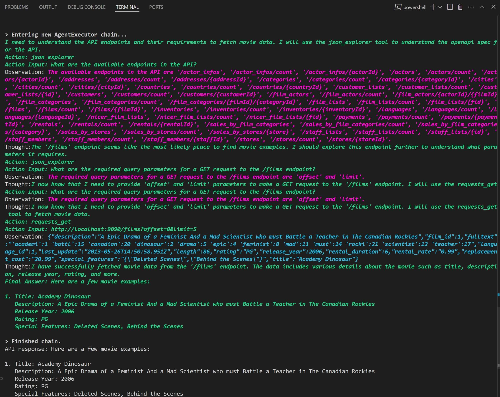

This guide explains how to integrate your Gateway-generated API with LangChain, allowing you to create AI agents that can interact with your data through the API.

## Prerequisites

Before integrating with LangChain, ensure you have:

1. A running Gateway API (either local or hosted)
2. Python 3.8+ installed
3. OpenAI API key or another compatible LLM provider

## Installing Required Packages

First, install the necessary Python packages:

```bash
# Install LangChain and related packages
pip install langchain langchain-openai langchain-community requests
```

## Integration Example

Here's a complete example of how to integrate a Gateway API with LangChain using the OpenAPI specification:

```python
import os
import requests
from langchain_community.agent_toolkits.openapi.toolkit import OpenAPIToolkit
from langchain_openai import ChatOpenAI
from langchain_community.utilities.requests import RequestsWrapper
from langchain_community.tools.json.tool import JsonSpec
from langchain.agents import initialize_agent

# Define API details
API_SPEC_URL = "https://dev1.centralmind.ai/openapi.json"  # Replace with your API's OpenAPI spec URL
BASE_API_URL = "https://dev1.centralmind.ai"               # Replace with your API's base URL

# Set OpenAI API key
os.environ["OPENAI_API_KEY"] = "your-openai-api-key"       # Replace with your actual API key

# Load and parse OpenAPI specification
api_spec = requests.get(API_SPEC_URL).json()
json_spec = JsonSpec(dict_=api_spec)

# Initialize components
# You can use X-API-KEY header to set authentication using API keys
llm = ChatOpenAI(model_name="gpt-4", temperature=0.0)
toolkit = OpenAPIToolkit.from_llm(llm, json_spec, RequestsWrapper(headers=None), allow_dangerous_requests=True)

# Set up the agent
agent = initialize_agent(toolkit.get_tools(), llm, agent="zero-shot-react-description", verbose=True)

# Make a request
result = agent.run(f"Find specs and pricing for instance c6g.large, use {BASE_API_URL}")
print("API response:", result)
```
As a result you should see a chain of thougth like this:



## Code Explanation

Let's break down the integration code:

### 1. API Configuration

```python
API_SPEC_URL = "https://dev1.centralmind.ai/openapi.json"
BASE_API_URL = "https://dev1.centralmind.ai"
```

- `API_SPEC_URL`: URL to your Gateway API's OpenAPI specification (Swagger JSON)
- `BASE_API_URL`: Base URL of your Gateway API

### 2. Load API Specification

```python
api_spec = requests.get(API_SPEC_URL).json()
json_spec = JsonSpec(dict_=api_spec)
```

This fetches the OpenAPI specification and converts it to a format LangChain can use.

### 3. Initialize LangChain Components

```python
llm = ChatOpenAI(model_name="gpt-4", temperature=0.0)
toolkit = OpenAPIToolkit.from_llm(llm, json_spec, RequestsWrapper(headers=None), allow_dangerous_requests=True)
```

- Creates a ChatOpenAI instance using GPT-4
- Initializes the OpenAPIToolkit with the API specification

### 4. Set Up and Run the Agent

```python
agent = initialize_agent(toolkit.get_tools(), llm, agent="zero-shot-react-description", verbose=True)
result = agent.run("Find specs and pricing for instance c6g.large")
```

- Creates an agent with the API tools
- Runs the agent with a natural language query

## Authentication Options

If your API requires authentication, you can add headers to the RequestsWrapper:

```python
# Example with API key authentication
headers = {
    "X-API-KEY": "your-api-key"
}
toolkit = OpenAPIToolkit.from_llm(llm, json_spec, RequestsWrapper(headers=headers), allow_dangerous_requests=True)
```

## Advanced Configuration

For more complex scenarios, you can:

1. **Add custom tools**: Combine Gateway API tools with other LangChain tools
2. **Use different agent types**: Try structured or conversational agents
3. **Customize prompts**: Create specialized instructions for the agent

## Troubleshooting

If you encounter issues:

1. Verify your API is running and accessible
2. Check that the OpenAPI spec URL returns a valid JSON document
3. Ensure your LLM API key is valid and has sufficient credits
4. Set `verbose=True` in the agent initialization to see detailed reasoning

For more detailed information on LangChain's OpenAPI integration, refer to the [LangChain Documentation](https://python.langchain.com/docs/integrations/tools/openapi).
