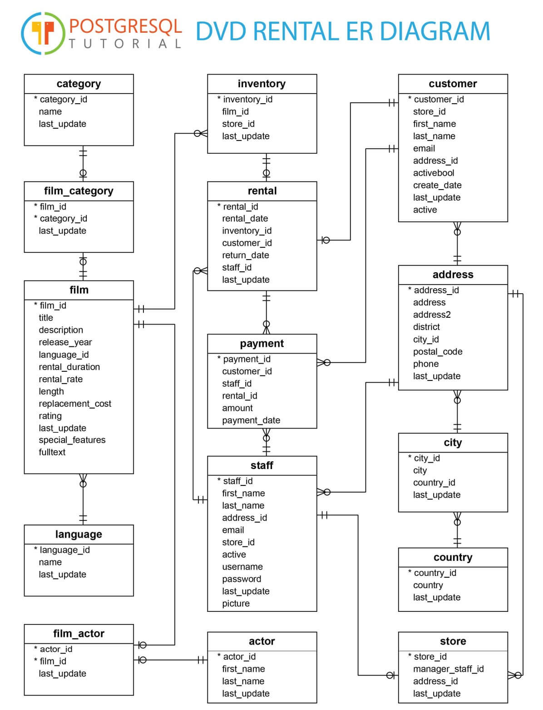

This guide explains how to set up a PostgreSQL database using Docker and restore the DVD Rental sample database.

## Prerequisites

- <a href="https://docs.docker.com/get-started/get-docker/">Docker</a> installed on your system
- curl or wget for downloading the sample database


## Setup Instructions

1. Pull PostgreSQL Docker image:

```bash
docker pull postgres
```

2. Start PostgreSQL container:

```bash
docker run -d \
    --name postgres-dvdrental \
    -e POSTGRES_PASSWORD=mysecretpassword \
    -e POSTGRES_USER=postgres \
    -e POSTGRES_DB=dvdrental \
    -p 5432:5432 \
    postgres
```

3. Download the sample database, that prepared by Neon:

```bash
curl -O https://neon.tech/postgresqltutorial/dvdrental.zip
```

4. Extract the downloaded file:

```bash
unzip dvdrental.zip
```

5. Copy the tar file into the container:

```bash
docker cp dvdrental.tar postgres-dvdrental:/tmp/
```

6. Restore the database:

```bash
docker exec -it postgres-dvdrental pg_restore -U postgres -d dvdrental /tmp/dvdrental.tar
```

## Verification

To verify the restoration was successful, you can connect to the database and check the tables:

```bash
docker exec -it postgres-dvdrental psql -U postgres -d dvdrental -c "\dt"
```

## Connection Details

You can use these connection details to connect to the database:

- Host: localhost
- Port: 5432
- Database: dvdrental
- Username: postgres
- Password: mysecretpassword

Create a `connection.yaml` file with these settings:

```bash
echo "hosts:
  - localhost
user: postgres
password: mysecretpassword
database: dvdrental
port: 5432" > connection.yaml
```

Or manually create `connection.yaml` with this content:

```yaml
hosts:
  - localhost
user: postgres
password: mysecretpassword
database: dvdrental
port: 5432
```

## Database Schema



The DVD Rental database represents a DVD rental store and includes tables for:
- films
- actors
- customers
- rentals
- payments
- stores
- staff
- and more

## Cleanup

To stop and remove the container:

```bash
docker stop postgres-dvdrental
docker rm postgres-dvdrental
```
